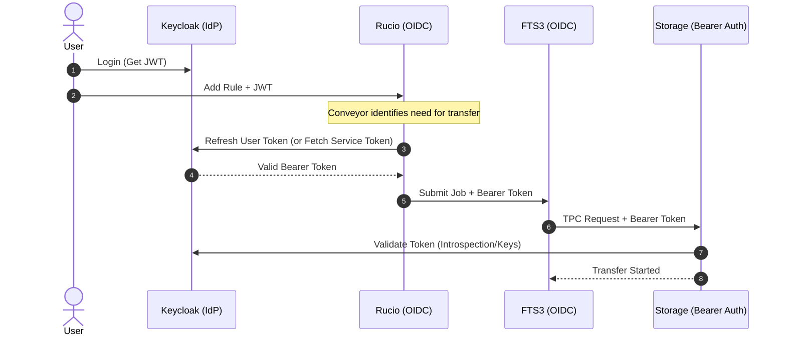
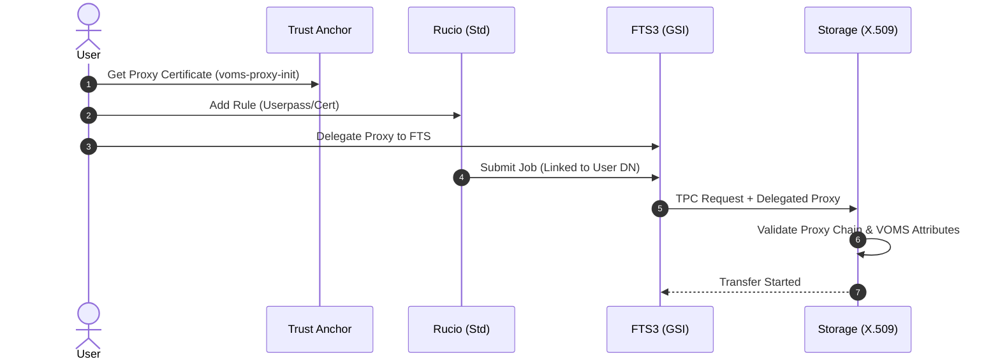

# rucio-storage-testbed

Multi-architecture Rucio + FTS3 integration testbed with XRootD, WebDAV, S3, StoRM WebDAV and Keycloak OIDC authentication. Enables end-to-end transfer testing on both `linux/amd64` and `linux/arm64`, including Apple Silicon Macs.

## Features in a nutshell

- **OIDC Bearer Token Orchestration:** Validated delegation flow from `rucio-oidc` conveyors to `fts-oidc` for token-based transfers.
- **XRootD SciTokens Integration:** Full support for `root://` TPC using the `xrootd-scitokens` plugin with audience-specific verification.
- **StoRM WebDAV HTTP-TPC:** StoRM setup with OIDC policy enforcement and bearer-token-mediated transfers.
- **Cross-Architecture Support:** Native `arm64` support for all services, including custom-built FTS3 and XRootD images for Silicon Macs.
- **One-Command Topology Bootstrap:** Automated setup of the entire Rucio topology, distances and OIDC identity providers in one command.
- **Resilient Test Suite:** Built-in validation of Rucio rule states, lock counts and Adler32 checksum streaming for minimal storage images.

> Future work includes reference implementations using the `rucio-clients`, K8s migration, failure injection and federation. See [ROADMAP.md](./ROADMAP.md).

## Quick start

```bash
# 1. Generate certificates (includes StoRM trust anchors and JVM cacerts)
./scripts/generate-certs.sh

# 2. Start the stack
docker compose up -d

# 3. Bootstrap Rucio (accounts, RSEs, OIDC identities, token providers)
./scripts/bootstrap-testbed.sh

# 4. Run transfer tests
./scripts/test-rucio-transfers.sh
```

## High Level Flow

The testbed supports two primary authentication and orchestration patterns:

### OIDC Token Flow (Modern)

Used for StoRM WebDAV and XRootD SciTokens integration.



**Note on Test Implementation:** In the [test-rucio-transfers.sh](./scripts/test-rucio-transfers.sh) script, we trigger the rule creation using `USERPASS` authentication to avoid the manual browser redirects required by a full OIDC login. Once the rule exists, the Rucio Conveyor daemons internally handle the OIDC token orchestration, fetching the necessary bearer tokens from Keycloak to submit the transfer job to FTS automatically.

### X.509 GSI Flow (Legacy/Standard)

Used for standard XRootD and WebDAV GSI-based transfers.



**Note on Test Implementation:** Similar to the OIDC flow, the test script uses `USERPASS` for the initial rule submission to simplify the CLI interaction. The backend Rucio Conveyor daemons are configured with host/service X.509 certificates to authenticate with FTS, which then uses delegated proxies to authorize the third-party copy (TPC) at the storage level.

## Stack

| Service | Description | Port |
|---|---|---|
| `fts` | FTS3 transfer server (GSI proxy auth, multi-arch) | 8446 |
| `fts-oidc` | FTS3 transfer server (OIDC bearer token auth) | 8447 |
| `rucio` | Rucio server — userpass auth | 8445 |
| `rucio-oidc` | Rucio server — OIDC auth via Keycloak | 8448 |
| `keycloak` | OIDC identity provider (token exchange enabled) | 8443 |
| `xrd1` / `xrd2` | XRootD storage endpoints | 1094 / 1095 |
| `webdav1` / `webdav2` | WebDAV storage endpoints (Apache mod\_dav) | 443 / 444 |
| `minio1` / `minio2` | S3-compatible storage | 9000 / 9002 |
| `storm1` / `storm2` | StoRM WebDAV (HTTP TPC + OIDC token auth) | 8440 / 8441 |

## Tests

| Protocol / Target | Auth Model | Execution Command |
| :--- | :--- | :--- |
| **XRootD TPC** | GSI Proxy | `docker exec -it rucio-storage-testbed-fts-1 python3 /scripts/test-fts-with-xrootd.py` |
| **S3 / MinIO** | Signed URLs | `./scripts/test-fts-with-s3.sh` |
| **WebDAV** | GSI Proxy | `./scripts/test-fts-with-webdav.sh` |
| **StoRM WebDAV** | OIDC Token | `./scripts/test-fts-with-storm-webdav.sh` |
| **XRootD TPC** | SciTokens | `./scripts/test-fts-with-xrootd-scitokens.sh` |
| **Rucio E2E** | Multi-auth | `./scripts/test-rucio-transfers.sh` |

## Documentation

Documentation can be found in the [docs folder](./docs/).

## References

- [rucio/containers — test-fts](https://github.com/rucio/containers/tree/master/test-fts)
- [rucio/k8s-tutorial](https://github.com/rucio/k8s-tutorial)
- [FTS3](https://gitlab.cern.ch/fts/fts3)
- [StoRM WebDAV](https://github.com/italiangrid/storm-webdav)
