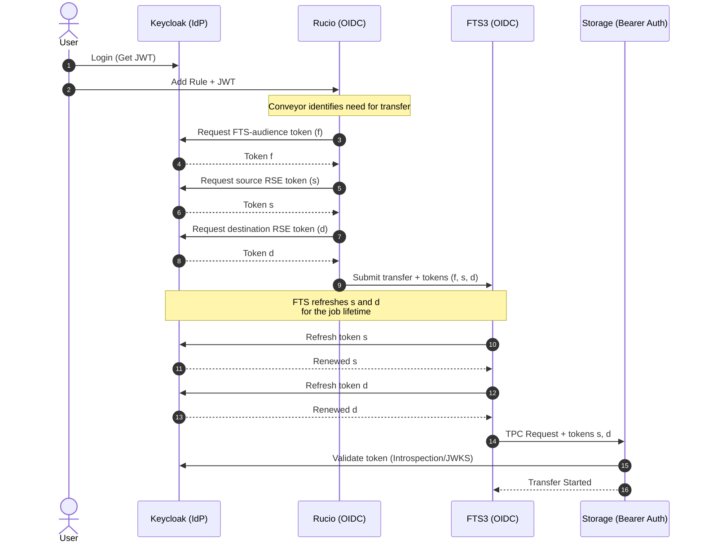
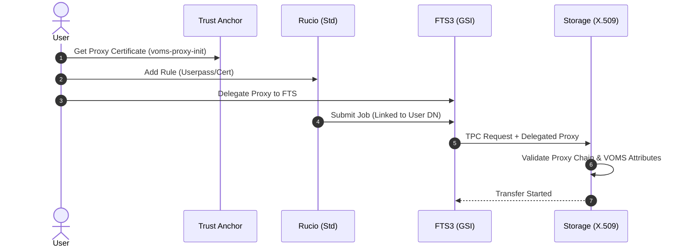

# rucio-storage-testbed

Multi-architecture Rucio + FTS3 integration testbed with XRootD, WebDAV, S3, StoRM WebDAV and Keycloak OIDC authentication. Enables end-to-end transfer testing on both `linux/amd64` and `linux/arm64`, including Apple Silicon Macs.

> **Design Goal:** This testbed is designed to validate **service-to-service orchestration**. While user interaction is simplified via `USERPASS` to streamline automation, the backend tests **OIDC token-based submission** and **GSI proxy delegation** across the Rucio-FTS-Storage chain.

## Features in a nutshell

- **OIDC Bearer Token Orchestration:** Validated delegation flow from `rucio-oidc` conveyors to `fts-oidc` for token-based transfers.
- **XRootD SciTokens Integration:** Full support for `root://` TPC using the `xrootd-scitokens` plugin with audience-specific verification.
- **StoRM WebDAV HTTP-TPC:** StoRM setup with OIDC policy enforcement and bearer-token-mediated transfers.
- **Cross-Architecture Support:** Native `arm64` support for all services, including custom-built FTS3 and XRootD images for Silicon Macs.
- **One-Command Topology Bootstrap:** Automated setup of the entire Rucio topology, distances and OIDC identity providers in one command.
- **Resilient Test Suite:** Built-in validation of Rucio rule states, lock counts and Adler32 checksum streaming for minimal storage images.

> Future work includes Dev Container integration, K8s migration and failure injection. See [ROADMAP.md](./ROADMAP.md).

## Quick start

### Docker Compose

The default runtime is compose.

```bash
# 1. Generate certificates
make certs

# 2. Start the stack
make compose-up

# 3. Bootstrap Rucio
RUNTIME=compose make bootstrap

# 4. Run transfer tests
RUNTIME=compose make test-rucio
# Or run the full suite at once
RUNTIME=compose make test-all
```

### Kubernetes

Pass `RUNTIME=k8s` to target the `kind` cluster.

```bash
# 1. Generate certificates
make certs

# 2. Install the Helm chart
make helm-install

# 3. Bootstrap Rucio
RUNTIME=k8s make bootstrap

# 4. Run transfer tests
RUNTIME=k8s make test-rucio
# Or run the full suite at once
RUNTIME=k8s make test-all
```

## Make targets

```bash
make help

  help                       Show this help (default target)

Setup
  certs                      Generate all certificates (CA, hosts, StoRM trust anchors, JVM cacerts)

Stack lifecycle (compose-*)
  compose-up                 Start the full stack in the background
  compose-down               Stop the stack and remove volumes
  compose-restart            Tear down and restart the stack
  compose-ps                 List running containers
  compose-logs               Tail logs from all services (Ctrl-C to exit)
  compose-logs-%             Tail logs from a single service, e.g. `make compose-logs-rucio`
  compose-build              Build local Docker images (fts, xrd, rucio-client-docker-kubectl)
  bootstrap                  Bootstrap Rucio (uses $RUNTIME — set RUNTIME=k8s for kubernetes)

Helm / Kubernetes lifecycle (helm-*, k8s-*)
  helm-lint                  Lint the umbrella chart
  helm-template              Render manifests locally (helm template …) without installing
  helm-install               Create the namespace and install the umbrella chart
  helm-upgrade               Apply local chart changes to the running release
  helm-uninstall             Uninstall the release and delete its PVCs
  helm-reinstall             Uninstall + install (full reset)
  k8s-pods                   List pods in the testbed namespace

Tests
  test-rucio                 Rucio E2E transfer test (bash version)
  test-xrootd-gsi            XRootD TPC test with X.509 GSI
  test-xrootd-oidc           XRootD TPC test with OIDC tokens (SciTokens)
  test-storm                 StoRM WebDAV TPC test with OIDC tokens
  test-webdav                WebDAV TPC test with X.509 GSI
  test-s3                    S3/MinIO test with signed URLs
  test-all                   Run all tests (in series)

Development
  lint                       Run pre-commit hooks on all files

Cleanup
  clean                      Remove generated certs and volumes; keep CA (rucio_ca.pem + key)
```

## High Level Flow

The testbed supports two primary authentication and orchestration patterns:

### OIDC Token Flow (Modern)

Used for StoRM WebDAV and XRootD SciTokens integration.



> Token orchestration follows the design described in [Rucio Token Workflow Evolution](https://rucio.cern.ch/documentation/files/Rucio_Tokens_v0.1.pdf). Rucio acquires separate tokens for FTS authentication and for source/destination storage access, then bundles all three into the FTS submission. FTS is responsible only for refreshing the storage-scoped tokens during the transfer lifetime.

**NOTE:** In the [test-rucio-transfers.py](./shared/scripts/test-rucio-transfers.py) script, we trigger the rule creation using `USERPASS` authentication to avoid the manual browser redirects required by a full OIDC login. Once the rule exists, the Rucio Conveyor daemons internally handle the OIDC token orchestration, fetching the necessary bearer tokens from Keycloak to submit the transfer job to FTS automatically.

### X.509 GSI Flow (Legacy/Standard)

Used for standard XRootD and WebDAV GSI-based transfers.



**NOTE:** Similar to the OIDC flow, the test script uses `USERPASS` for the initial rule submission to simplify the CLI interaction. The backend Rucio Conveyor daemons are configured with host/service X.509 certificates to authenticate with FTS, which then uses delegated proxies to authorize the third-party copy (TPC) at the storage level.

## Tests

| Protocol / Target | Auth Model | Execution Command |
| :--- | :--- | :--- |
| **Rucio E2E** | Hybrid (Userpass + GSI + OIDC) | `./shared/scripts/test-rucio-transfers.py` |
| **XRootD TPC** | X.509 GSI | `docker exec -it compose-fts-1 python3 /scripts/test-fts-with-xrootd.py` |
| **S3 / MinIO** | Signed URLs | `./shared/scripts/test-fts-with-s3.sh` |
| **WebDAV** | X.509 GSI | `./shared/scripts/test-fts-with-webdav.sh` |
| **StoRM WebDAV** | OIDC Token | `./shared/scripts/test-fts-with-storm-webdav.sh` |
| **XRootD TPC** | OIDC Token | `./shared/scripts/test-fts-with-xrootd-scitokens.sh` |

**NOTE:** The Rucio E2E tests validate the Manual Registration pattern (view [the user workflows document](./docs/user-workflows.md)), where files are seeded directly onto storage before being registered in the Rucio catalog.

## Documentation

Documentation can be found in the [docs folder](./docs/).

## References

- [rucio/containers — test-fts](https://github.com/rucio/containers/tree/master/test-fts)
- [rucio/k8s-tutorial](https://github.com/rucio/k8s-tutorial)
- [FTS3](https://gitlab.cern.ch/fts/fts3)
- [StoRM WebDAV](https://github.com/italiangrid/storm-webdav)
