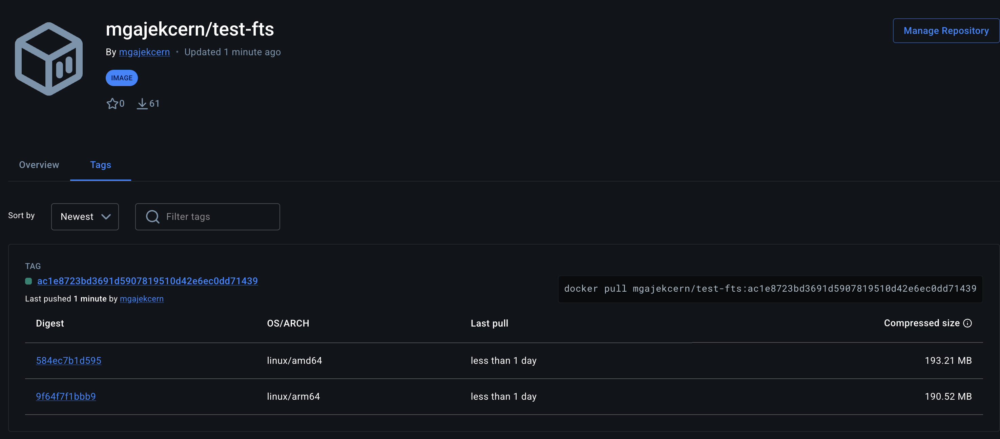

# rucio-storage-testbed

Multi-architecture Rucio + FTS3 integration testbed with XRootD, WebDAV, S3 and Keycloak OIDC authentication. Enables end-to-end transfer testing on both linux/amd64 and linux/arm64, including Apple Silicon Macs.

## TODO

- [ ] docker-compose — Demonstrate both username/pass and OIDC token–based authentication
- [ ] docker-compose — Demonstrate TPC with production-like systems (mainly intertwin/teapot; optionally dCache and EOS, though their configuration is somewhat time-consuming), including Storm-WebDav containers
- [ ] k8s tutorial — Map and organize knowledge within the forked repository

## Repository structure

```
rucio-storage-testbed/
├── .github/workflows/
│   ├── build-fts-multiarch.yml   # Build and push multi-arch image to Docker Hub
│   └── integration-test.yml      # End-to-end storage integration tests
├── certs/                        # Runtime certificates — git-ignored except CA files
│   ├── rucio_ca.pem              # CA certificate (from k8s-tutorial/secrets/)
│   └── rucio_ca.key.pem          # CA private key
├── config/
│   ├── fts3config                # FTS3 server configuration
│   ├── fts3restconfig            # REST frontend configuration
│   ├── fts3rest.conf             # Apache/httpd configuration
│   ├── fts-activemq.conf         # ActiveMQ messaging configuration
│   ├── gfal2_http_plugin.conf    # gfal2 HTTP plugin (S3 credentials, WebDAV settings)
├── docs/
│   ├── certificates.md                 # Certificate generation setup
│   └── storage-integration-testing.md  # XRootD, S3, WebDAV test guide
├── scripts/
│   ├── docker-entrypoint.sh
│   ├── test-fts-with-xrootd.py   # XRootD TPC test (run inside FTS container)
│   ├── test-fts-with-s3.sh       # S3/MinIO transfer test
│   ├── test-fts-with-webdav.sh   # WebDAV transfer test
│   ├── wait-for-it.sh
│   ├── bootstrap-db.py           # initializes the Rucio database before the server starts
│   ├── rucio-init.sh             # initializes Rucio accounts, RSEs, protocols, distances and quotas once the server has started
│   └── logshow
├── Dockerfile
├── docker-compose.yml
└── README.md
```

## Known issues on macOS (Apple Silicon)

The vfkit driver frequently fails with SSH errors when using [rucio/k8s-tutorial](https://github.com/rucio/k8s-tutorial). When switching to the Docker driver, `fts-server` stalls because `rucio/test-fts` has no `arm64` manifest:

```
Warning  Failed  kubelet  Failed to pull image "rucio/test-fts":
         no matching manifest for linux/arm64/v8 in the manifest list entries
```

**Fix:** use the image built by this repository instead.

## Build

### CI (GitHub Actions)

The image is built on manual trigger via `.github/workflows/build-fts-multiarch.yml` using QEMU on an `ubuntu-latest` runner and pushed to Docker Hub.

> Cross-compilation for `linux/arm64` via QEMU is slow — expect 45–90 minutes for a full build.



### Local

```bash
# Current platform only (fast)
docker build -t test-fts:local .

# Multi-arch (requires buildx)
docker buildx create --use
docker buildx build --platform linux/amd64,linux/arm64 -t test-fts:local .
```

## Quick start

```bash
# 1. Generate certificates (see docs/certificates.md)
# 2. Start the stack
docker compose up -d

# 3. Verify FTS is up
# no authentication
curl -sk https://localhost:8446/whoami
# certificate-based authentication
curl -sk --cert certs/hostcert.pem --key certs/hostkey.pem --cacert certs/rucio_ca.pem https://localhost:8446/whoami
```

For certificate generation details see [docs/certificates.md](docs/certificates.md).

For storage transfer tests (XRootD, S3, WebDAV) see [docs/storage-integration-testing.md](docs/storage-integration-testing.md).

## References

- [Official test-fts image (x86_64)](https://github.com/rucio/containers/tree/master/test-fts)
- [FTS3 Dockerfile](https://gitlab.cern.ch/fts/fts3/-/blob/3.14.x-release/packaging/docker/Dockerfile)
- [fts-rest-flask](https://gitlab.cern.ch/fts/fts-rest-flask)
- [rucio/k8s-tutorial](https://github.com/rucio/k8s-tutorial)
- [RFC-2518](https://datatracker.ietf.org/doc/html/rfc2518)