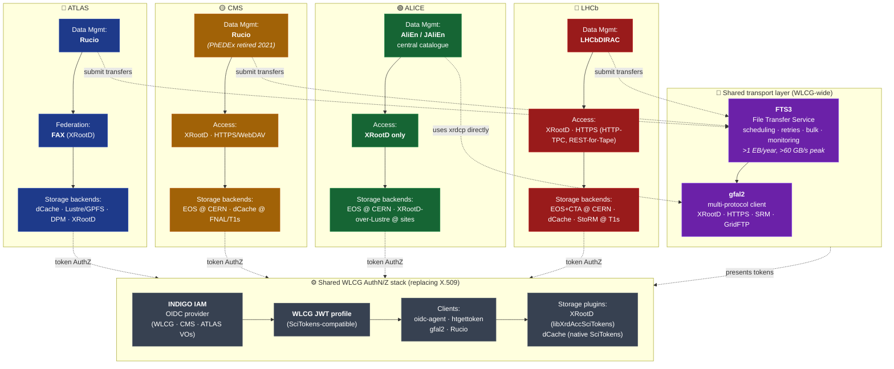

# Storage Stacks of the Major LHC Experiments

A short breakdown of the storage technologies favored by each of the four major LHC experiments, plus a summary of the "OIDC stack" that is replacing the legacy X.509 grid-certificate infrastructure in WLCG.

## The data-movement layer: FTS3 + gfal2

Rucio (and DIRAC) don't push bytes themselves — they delegate to **FTS3**, the WLCG-wide File Transfer Service developed at CERN. This separation matters: data-management frameworks handle *policy* (which datasets should be where, which rules apply, accounting, consistency) while FTS3 handles *scheduling and execution* of the actual third-party copies between storage endpoints.

- **FTS3 scale:** "In 2020 alone, the centrally monitored FTS3 instances transferred more than 1 billion files and a total of 1 exabyte of data with global transfer rates regularly exceeding 60 GB/s." FTS3 is "integrated with experiment frameworks such as Rucio and DIRAC and is used by more than 35 experiments at CERN." Source: *FTS3: Data Movement Service in containers deployed in OKD* (CHEP 2021, CDS 2813806): <https://cds.cern.ch/record/2813806/files/document.pdf>
- **How Rucio calls FTS3:** the Rucio `FTS3Transfertool` exposes exactly the operations you'd expect — `submit()`, `cancel()`, `query()`, `update_priority()`, `bulk_query()`, plus SE-level throttling (`set_se_config`). See the Rucio developer docs: <https://rucio.cern.ch/documentation/html/transfer_tools/fts3.html>
- **gfal2 under the hood:** FTS3 uses **gfal2** (Grid File Access Library) to implement transfers across protocols — XRootD, HTTP(S)/WebDAV, SRM, GridFTP (deprecated), etc. gfal2 is the multi-protocol abstraction; FTS3 is the scheduler on top. See PoS(ISGC2015)028 *FTS3 – a file transfer service for Grids, HPCs and Clouds*: <https://pos.sissa.it/239/028/pdf>
- **CMS's own workbook describes Rucio as sitting "above various grid middleware [SRM, FTS (File Transfer Service)] to manage large-scale transfers"**: <https://twiki.cern.ch/twiki/bin/view/CMSPublic/WorkBookFileTransfer>
- **Token-aware FTS3:** recent FTS3 versions accept WLCG JWTs (from IAM or CILogon) so the whole chain — user → Rucio/DIRAC → FTS3 → storage endpoint — can run on OIDC tokens without any X.509 proxy. This is what makes the OIDC stack end-to-end.

So the correct mental model for a dataset replication in Run-3 WLCG is:

```
Rucio rule evaluation  →  FTS3 transfer job  →  gfal2 protocol plugin
      (policy)               (scheduling)          (XRootD / HTTPS)
                                                   ↓
                                        Third-party copy between
                                        source SE and destination SE
```

For LHCb, replace "Rucio rule evaluation" with "LHCbDIRAC Data Management System" — the rest of the chain is identical.

---

## ATLAS — XRootD federation over mixed backends (dCache, Lustre, DPM, etc.)

ATLAS's data-access model is built around the **FAX (Federated ATLAS XRootD)** federation, which exposes a global namespace across heterogeneous site storage. In practice this means ATLAS uses *whatever storage a site deploys* (dCache, Lustre/GPFS, DPM, native XRootD) and federates it via XRootD.

- The FAX design paper describes how "a number of dCache sites join FAX by exposing XRootD doors to the backend system via a special 'xrootd4j' plugin," and how POSIX/DPM/dCache backends are all accessed through XRootD servers or proxies. See *Data federation strategies for ATLAS using XRootD* (CERN-CDS, ATL-SOFT-PROC-2013-039): <https://cds.cern.ch/record/1622223/files/ATL-SOFT-PROC-2013-039.pdf>
- The FNAL/US-ATLAS federation write-up explicitly notes that "The Tier 1 center uses dCache for the backend storage, as do two of the Tier 2s. As the remaining three Tier 2s use Xrootd, GPFS or Lustre file systems, the utility of Xrootd as a federation technology was seen as particularly advantageous": <https://lss.fnal.gov/archive/2012/conf/fermilab-conf-12-839-cd.pdf>
- IN2P3 (Tier-1 for ATLAS/CMS/LHCb) explicitly exposes XRootD endpoints on top of dCache (`ccxrootdatlas.in2p3.fr`): <https://doc.cc.in2p3.fr/en/Data-storage/distributed-storage/dcache.html>

So a more accurate phrasing for ATLAS is: **XRootD as the access/federation layer, on top of site-chosen backends (very often dCache at Tier-1s)**.

## CMS — Rucio for data management; dCache, EOS, and XRootD as storage

CMS's computing model historically ran on **PhEDEx** for data placement, which was tightly coupled to dCache/CASTOR at most Tier-1s. PhEDEx was **fully replaced by Rucio** in 2020/2021.

- Transition paper: *Transitioning CMS to Rucio Data Management* (CHEP 2019 / EPJ Web of Conferences): <https://www.epj-conferences.org/articles/epjconf/pdf/2020/21/epjconf_chep2020_04033.pdf>
- *Experience with Rucio in the wider HEP community* (OSTI 1817190) documents the cutover: "In early October the vast majority of data was being transferred by PhEDEx ... by late October the vast majority of data was being moved by Rucio ... all data management for CMS is being done by Rucio in 2021": <https://www.osti.gov/servlets/purl/1817190>
- CMS Tier-0 (at CERN) writes to **EOS** (`T0_CH_CERN_Disk`) and uses Rucio to ship outputs to Tier-1 tape and disk endpoints. CHEP 2023 paper *CMS Tier-0 data processing during the detector commissioning in Run 3*: <https://www.epj-conferences.org/articles/epjconf/pdf/2024/05/epjconf_chep2024_03007.pdf>
- At FNAL (the US CMS Tier-1), **dCache** remains the backend in front of Enstore tape: see PhEDEx consistency paper referencing "Fermilab, using dCache as its disk cache in front of the Enstore tape system": <https://1library.net/document/q77pv0dq-ensuring-data-consistency-over-cms-distributed-computing-system.html>

Summary: **CMS = Rucio + mixed storage (dCache at several Tier-1s, EOS at CERN, XRootD access everywhere).**

## ALICE — EOS + XRootD, end to end

ALICE is the one experiment where "built on XRootD" is literally correct: its data-access model specifies **"exclusive use of the xrootd protocol for data access,"** with file catalog lookups handled by AliEn/JAliEn's central catalogue. EOS (CERN's XRootD-based disk store) is the default for newly deployed storage.

- ALICE data access model slides (C. Grigoras): "Exclusive use of xrootd protocol for data access ... For newly deployed storage we plan to use EOS": <https://www.slideserve.com/denise/alice-data-access-model-powerpoint-ppt-presentation>
- IN2P3's service documentation: "The ALICE experiment bases its data management model on the XRootD protocol": <https://doc.cc.in2p3.fr/en/Data-storage/distributed-storage/xrootd.html>
- *Operation of the CERN disk storage infrastructure during LHC Run-3* (CHEP 2024) describes the ALICE-specific **EPN2EOS** pipeline feeding EOS from the online farm: <https://www.epj-conferences.org/articles/epjconf/pdf/2024/05/epjconf_chep2024_01041.pdf>
- At Tier-2s like GSI, the SE is "locally maintained XRootD redirectors and data servers which in turn query the local parallel file system Lustre": <https://virgo-docs.hpc.gsi.de/blog/posts/2023-11-15-AF-at-GSI/>

Summary: **ALICE = XRootD protocol everywhere, EOS as the reference backend at CERN, local XRootD (often over Lustre) at sites.**

## LHCb — DIRAC on top of mixed storage (EOS+CTA at CERN, dCache/StoRM at Tier-1s)

LHCb uses its own workload and data management system, **LHCbDIRAC** (an extension of the DIRAC framework). For storage, LHCb relies on whatever each Tier-1 provides — historically a mix of CASTOR, dCache, and StoRM — and on **EOS + CTA** (CERN Tape Archive) at CERN.

- *LHCbDirac: distributed computing in LHCb* describes the Tier-1↔Tier-0 archive workflow going through `eosctalhcb` with XRootD for the Check-On-Tape step, and participation in the HTTP REST API for Tape project with dCache, EOS+CTA, and StoRM: <https://www.researchgate.net/publication/258668306_LHCbDirac_distributed_computing_in_LHCb>
- LHCb's archiving documentation explicitly names Castor/dCache/StoRM as the underlying SRM implementations at Tier-1s: <https://twiki.cern.ch/twiki/bin/view/LHCb/ArchivingDatasets>
- Original *DIRAC: reliable data management for LHCb* paper: <https://inspirehep.net/files/f8cbd48f16c881fe41a3bdb8a0ed5683>

Summary: **LHCb = DIRAC (not Rucio) + a mix of dCache, StoRM, and EOS+CTA.**

---

## The "OIDC stack" — what's replacing X.509 grid certificates

WLCG is mid-transition from VOMS-signed X.509 proxies to **bearer tokens** (JWTs) issued by an **OIDC provider**. The reference stack is:

1. **Identity provider:** **INDIGO IAM** — the OIDC/OAuth2 service developed by the INDIGO-DataCloud project and operated by INFN-CNAF for the WLCG VOs (e.g. `https://wlcg.cloud.cnaf.infn.it/`, `https://cms-auth.web.cern.ch/`). See A. Ceccanti, *Identity and Access Management with the INDIGO IAM service*: <https://indico.cern.ch/event/739896/contributions/3497694/attachments/1905332/3146590/IAM-WLCG-AuthZ-Fermilab-10092019.pdf>
2. **Token format:** The **WLCG JWT profile**, defined by the WLCG AuthZ WG and compatible with the SciTokens profile: <https://github.com/WLCG-AuthZ-WG/common-jwt-profile/blob/master/profile.md>
3. **Clients:** `oidc-agent` / `htgettoken` for token acquisition; `gfal2` (with `BEARER` credentials) and Rucio (with `auth_type = oidc`) for transfer orchestration. See the WLCG AuthZ cookbook: <https://wlcg-authz-wg.github.io/wlcg-authz-docs/token-based-authorization/>
4. **Storage-side authorization:** **XRootD** via the `libXrdAccSciTokens` plugin (now upstream in XRootD) and **dCache** via its native SciTokens/WLCG-JWT support. XRootD config reference: <https://wlcg-authz-wg.github.io/wlcg-authz-docs/token-based-authorization/configuration/xrootd/> and plugin source: <https://github.com/scitokens/xrootd-scitokens>
5. **Transition timeline:** WLCG AuthZ WG, *Transition from X.509 to Tokens* (CHEP 2023, T. Dack): <https://indico.jlab.org/event/459/contributions/11492/attachments/9358/13998/TDack_Chep23_WLCGTokens.pdf>

### Minimal XRootD–IAM mapping example

A canonical `scitokens.cfg` entry that maps an OIDC-issued WLCG token to a local account on an XRootD server (taken from the WLCG AuthZ WG docs):

```ini
[Global]
onmissing = passthrough
audience = https://wlcg.cern.ch/jwt/v1/any, https://xrd.example.com:1094

[Issuer WLCG IAM]
issuer     = https://wlcg.cloud.cnaf.infn.it/
base_path  = /data/grid/wlcg
map_subject = false
default_user = xrootd
```

Loaded in `xrootd.cfg` via:

```
ofs.authlib ++ libXrdAccSciTokens.so config=/etc/xrootd/scitokens.cfg
ofs.authorize 1
```

Source: <https://wlcg-authz-wg.github.io/wlcg-authz-docs/token-based-authorization/configuration/xrootd/>

---

## High-level structural diagram



**Reading the diagram:** each experiment has its own top-to-bottom stack — data-management framework → access protocol/federation → storage backends. The dotted lines show two shared layers underneath:
- **Transport:** Rucio (ATLAS, CMS) and LHCbDIRAC submit transfer jobs to the same shared **FTS3** service, which uses **gfal2** to execute the actual third-party copies over XRootD/HTTPS/etc. ALICE is the exception — its jobs read/write directly via XRootD (`xrdcp`, `xrdfs`) driven by AliEn/JAliEn, without a central transfer scheduler.
- **Auth:** all four experiments' storage endpoints, plus FTS3 itself, are converging on the same **WLCG token stack** (INDIGO IAM → WLCG JWT → XRootD/dCache SciTokens plugins) that replaces legacy X.509 grid certificates.

---

## Quick-reference table

| Experiment | Data management (policy/catalog) | Transport (bytes) | Primary storage tech (CERN / Tier-1) | Access protocol |
|---|---|---|---|---|
| ATLAS | Rucio | FTS3 + gfal2 | Mixed; dCache common at Tier-1s, Lustre/GPFS/DPM at Tier-2s, federated via FAX | XRootD (over dCache/POSIX) |
| CMS | Rucio (PhEDEx retired) | FTS3 + gfal2 | EOS at CERN; dCache at FNAL and several other Tier-1s | XRootD + HTTPS/WebDAV |
| ALICE | AliEn/JAliEn central catalogue | direct XRootD (no central transfer scheduler) | EOS at CERN, XRootD (often over Lustre) elsewhere | XRootD (exclusively) |
| LHCb | LHCbDIRAC | FTS3 + gfal2 | EOS+CTA at CERN; mix of dCache, StoRM at Tier-1s | XRootD + HTTPS (with HTTP-TPC and REST-for-tape) |
