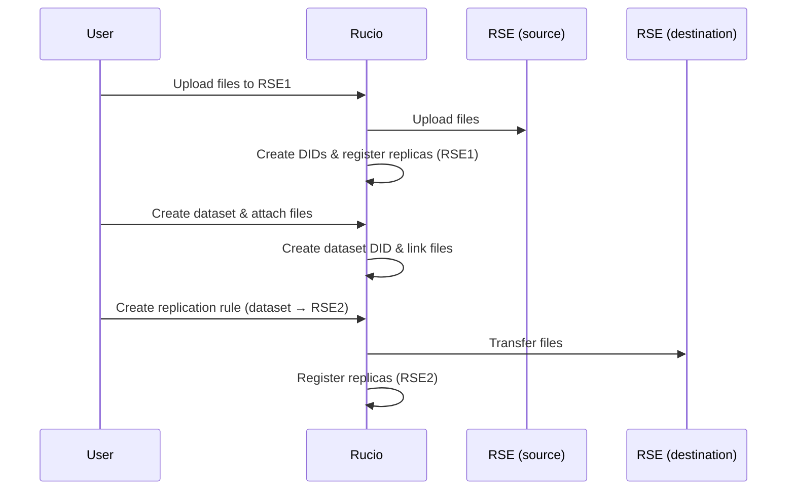
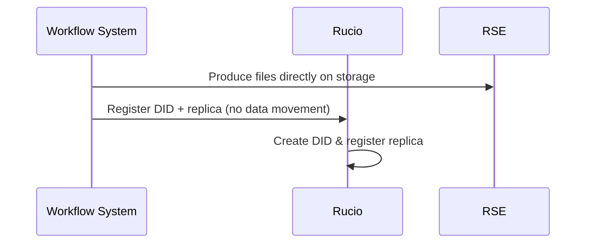

# User Workflows: Rucio DID Creation and Replication

Rucio supports two primary workflows for bringing data under management. The testbed's E2E scripts (`test-rucio-transfers.py`) specifically validate **Workflow B**.

## A) Managed Upload
Files are uploaded through Rucio, which handles both data transfer and metadata registration.
**Use case:** Institutional data ingestion, user-uploaded research data.

## B) Manual Registration (Testbed Default)
Files already exist in storage (produced by external workflows). Rucio registers metadata without moving data.
**Use case:** External data spaces (EUCAIM), HPC outputs.

## Key Concepts
- **DID (Data Identifier):** Represents a single logical file or dataset.
- **Replica:** A physical copy of a DID on a specific Rucio Storage Element (RSE).
- **Replication Rules:** Logic that triggers the Rucio-FTS chain to create additional replicas.
